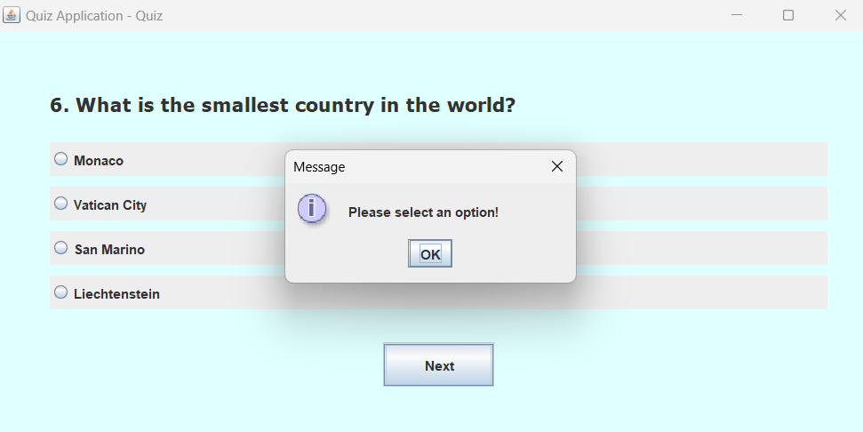

# Quiz Application

A simple quiz application built using Java and Swing. This app allows users to take a quiz, view the rules, answer multiple-choice questions, and see their final score at the end. It also maintains a leaderboard of high scores.

## Features
- **Login Screen**: Allows users to enter their name to start the quiz.
- **Rules Screen**: Displays the rules of the quiz.
- **Quiz Screen**: Displays questions with multiple-choice answers. Users can answer questions and move to the next one.
- **Leaderboard**: Maintains a list of high scores based on the user's performance in the quiz.
- **Score Screen**: Shows the final score once the quiz is completed.

## Screenshots





## Requirements
- Java 8 or higher.
- Swing library (comes with the Java JDK, no need to install separately).

## How to Run the Application

1. **Clone the repository** to your local machine:
   ```bash
   git clone https://github.com/yourusername/QuizApp.git
